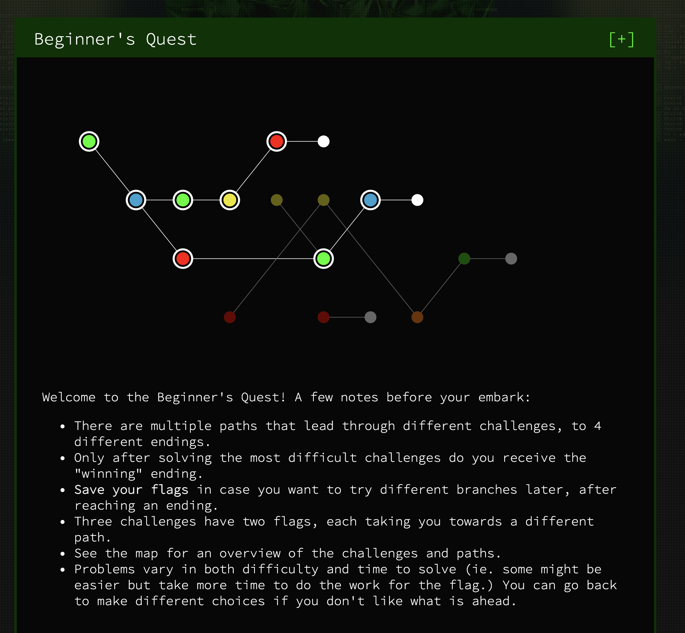

# Beginner's Quest

## Prompt

You are a simple life form, exiled from your home planet and in search of a new place to call home. The ruling came fast. Your taste in music was deemed to be far too "out-there-man" for anyone to possibly associate with you anymore. You were given 60 revolutions of Xenon around Fir to leave and never return. Gather whatever possessions and leave. You find your parents music collection, oddly in it is a golden disc labelled "Property of NASA, if lost please return to: EVNJAKL 1600 Ampitheatre Parkway Mountain View California." The music on the disc was uncovered a while back and was not very interesting. This weird language that said something about "Peace, love and rock and roll. Also we're having a really cool party tonight, so for whoever is out there, bring a friend and come along! Co-ordinates enclosed." On the back the words "Draft, do not distribute or load onto probe" written in big red letters. That could mean anything.

You'll go, since you have nowhere else to go. But you'll be careful. You well know to learn all you can about alien beings before making contact. They could be hostile, or listen to boring music. Time is slipping away fast, you race aboard the nearest ObarPool Spaceship. But you've never driven one... what next genius?

## Progress

- [x] Enter Space-Time Coordinates
- [x] Satellite 
- [x] Home Computer
- [x] Work Computer
- [x] Government Agriculture Network
- [x] FriendSpaceBookPlusAllAccessRedPremium.com
- [x] STOP GAN (END)
- [x] Drive to the target (END) 

## Endings

### STOP GAN Ending

Congratulations, you have destroyed the system. With an undeserved sense of accomplishment and ill-gotten stash of cauliflower pictures. You fly off triumphant, if totally misguided. It soon becomes very apparent that the pictures were just like the sculptures back home of you when you were younger. A mere representation of what was. Upon circling back to the big blue planet, you wonder what would have happened if you took a different path, maybe that work computer would have brought you closer to the real thing. Ah well. Time to find some friends and companionship or maybe a new home, one way or another. You lift your tendril to the console - what now?

### Drive to target Ending

Well that was a waste. After arriving, You spent 6 hours in the presence of a Biped who wanted to tell you all these stories about "their grandchildren" and "cats" Neither of which you knew what it was, or why you should care. After sitting there and nodding (or in your case, wobbling back and forth) for what seemed like an eternity, the biped falls asleep. You surmise that it must be the regular circadian rhythm time of revolution for them and turn to leave. As you leave the planet, you wonder. Will you ever find the mysterious picture entity? Did the Bipeds rule down there (if so it looks like they're doing a bad job at it)? Did anyone ever detect your ship, your presence and your landing? Will you ever find a new home? True Love? All of these questions however belong to that of philosophers and Poets. Unsatisfied, but ultimately uninjured, you set out in to the vast emptiness of space, searching forevermore.

Of course, you could always see what would have happened if you found different clues down there.
