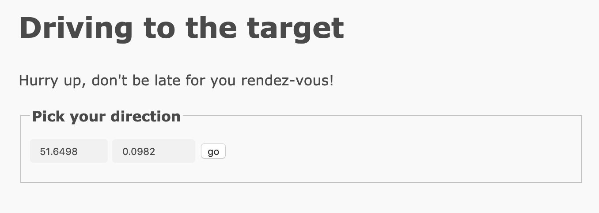

# Drive to the target (coding)

## Prompt

Excellent work!  With your fine sleuthing skills, you managed to find a picture of the handsome creature with its pet biped.  At last friends and companionship may be near!

Like all inhabitants of this world, you spend an inordinate amount of time on the site, stalking and comparing your life to that of others. The first thought that springs to your mind is "Why haven't I ever been to Mauritius on holiday?" followed swiftly by "What is a Mauritius anyway?" But after a while and with language successfully deciphered, you've made contact with the lifeform in the picture, you have a "date"? You're given the address of where to meet your potential interest. "1 Banana way, beware of the glass." An odd address, especially that last part. So how do you get there?  You land your ship and begin to search.

## Files

* `brute_force.py`: Script to automate 'driving' process.
* `coords.txt`: Final coordinates.
* `flag.txt`: Solution to this challenge.

## Solution 

Heading to https://drivetothetarget.web.ctfcompetition.com shows us this page:



Changing one of the values pretty drastically will print out something like...

```
Woa, were about to move at 10865km/h, this is too fast!
```

Making a smaller change gives this message:

```
You went 11m at a speed of 0km/h. You are getting away…
```

These seem to be coordinates because of the `lat` and `lon` arguments in the URL, and there is also a `token` argument. Typing these coordinates into Google Maps reveals our starting location:


Because the website lets us know when we're getting closer or further away from  our target, we can write a program that will make incremental changes to the coordinates that lead us to the target just like that game 'colder/warmer'.

If we move along one axis in the 'warmer' direction, eventually we will be directly above or to the side of our destination, receive the 'colder' message, and know to switch to the other axis. On the other axis we can move in the 'warmer' direction until we get right past the correct destination and then print out the token. Using the token, we can use the browser to get back the progress made by the automated driving program and hone in the coordinates with just a few adjustments. 

My script took a while (maybe 30 minutes?), but then I typed in my token and got the flag!


Try and see if you can get a more optimized driving program. Another quicker solution would be to print the server response after narrowing down the coordinates so you don't have to depend on the browser at all.
