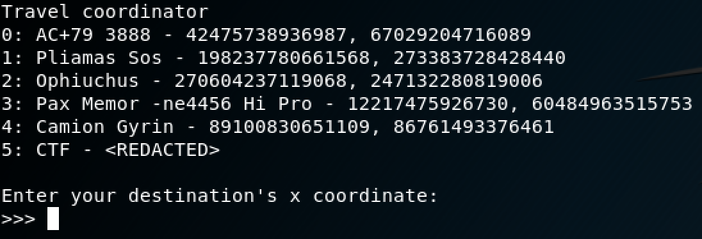

# Enter Space-Time Coordinates (misc)

## Prompt

Ok well done. The console is on. It's asking for coordinates. Beating heavily on the console yields little results, but the only time anything changes on your display is when you put in numbers.. So what numbers are you going to go for?  You see the starship's logs, but is there a manual? Or should you just keep beating the console?

## Files

* `files.zip`: Provided zip that contains `log.txt` and `rand2`.
* `log.txt`: Log of previous coordinates.
* `rand2`: A coordinate entering system.
* `flag.txt`: The solution to this challenge.

## Solution

`log.txt` seems to be a list of previously entered coordinates. Let's see what happens when we try to interact with the coordinate system. `./rand2`:



CTF sounds promising! Unfortunately this set of coordinates is redacted. One fantastic command that should always be run on files like this is the `strings` command. It will search a file for any Ascii strings that may be hiding. For large files it can produce a lot of output, but the man page (`man strings`) has filters to limit the output or it can be used with other helpful commands like `grep`. 

```
strings rand2 | grep CTF
```

This command will search for Ascii strings inside of the `rand2` file, then pipe that output into another command called `grep`. `grep` will only output strings that contain the substring 'CTF':

```
Arrived at the flag. Congrats, your flag is: CTF{welcome_to_googlectf}
```

It's generally a good idea to run a set of analysis tools like `strings`, `file`, and `binwalk` on all files encountered in CTFs to find hidden information.
