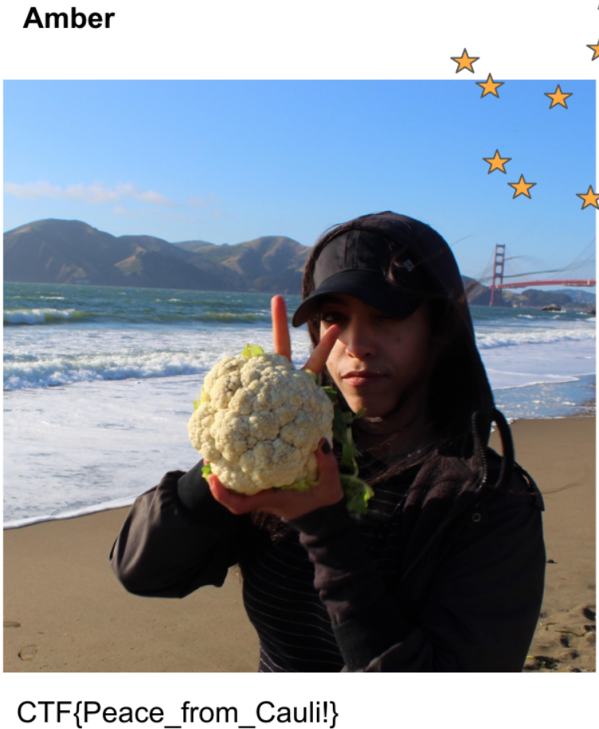

# FriendSpaceBookPlusAllAccessRedPremium.com (reversing)

## Prompt

Having snooped around like the expert spy you were never trained to be, you found something that takes your interest: "Cookie/www.FriendSpaceBookPlusAllAccessRedPremium.com"  But unbeknownst to you, it was only the  700nm Wavelength herring rather than a delicious cookie that you could have found.   It looks exactly like a credential for another system.  You find yourself in search of a friendly book to read.

Having already spent some time trying to find a way to gain more intelligence... and learn about those fluffy creatures, you (several)-momentarily divert your attention here.  It's a place of all the individuals in the world sharing large amounts of data with one another. Strangely enough, all of the inhabitants seem to speak using this weird pictorial language. And there is hot disagreement over what the meaning of an eggplant is.

But not much Cauliflower here.  They must be very private creatures.  SarahH has left open some proprietary tools, surely running this will take you to them.  Decipher this language and move forth!

## Files

* `files.zip`: Provided zip file that contains `vm.py` and `program`.
* `vm.py`: Stack based virtual machine that takes emojis as input.
* `program`: Emoji program that seems to be trying to print out a URL.
* `debug_vm.py`: A copy of `program` used for reverse engineering.
* `debug.out`: Output of `debug_vm.py`.
* `hello_world`: Hello world emoji program.
* `stack.txt`: List of stack values.
* `prime.txt`: List of palindromic primes.
* `decode_xor.py`: Program to XOR stack and primes to get link.
* `link.txt`: Reverse engineered URL.
* `flag.txt`: Solution to this challenge.

## Solution

Running the program with `python3 vm.py program` starts to print out what looks like a URL:

```
http://emoji-t0anaxn
```

But it seems like it will take a long time to finish. `program` is full of emojis, so let's jump to the `vm.py` file to figure out exactly what the emojis mean:

```
'🍡': add,
'🤡': clone,
'📐': divide,
'😲': if_zero,
'😄': if_not_zero,
'🏀': jump_to,
'🚛': load,
'📬': modulo,
'⭐': multiply,
'🍿': pop,
'📤': pop_out,
'🎤': print_top,
'📥': push,
'🔪': sub,
'🌓': xor,
'⛰': jump_top,
'⌛': exit
``` 

This key helps, but there are still lots of emojis like `🥇` and `✋` that are not here. Those can be found by looking at the `load` function code. Another confusing set of emojis that may not be obvious are groupings that look like this:

```
🖋💠🏁🎌🔶🚩
```

The `🖋` marks the beginning of an assembly-like label. The flags that follow are unique so that this spot can be jumped to in the future. `🏀` jumps to the label after `💰`. `hello_world` shows how jumps and labels can be used to pop and print everything off of the stack. 

Now that we understand how the code works, we can start reversing. It seems that a bunch of values are pushed on the stack, a complicated function is called, and then a character is printed. This process happens three times and then the program exits. Because the stack values continue to grow, I'm led to believe that some computation is too taxing to print out the entire URL in a reasonable amount of time.

Another interesting thing is that the XOR operation (`🌓`) takes place before every print (`🎤`). Lucky for us, `vm.py` is Python so we should be able to figure out what values the program is XORing. `debug_vm.py` is a slightly modified version of `vm.py` that prints out the XOR values and the result:

```
Running ....
xor 2 106 = 104
xor 3 119 = 116
xor 5 113 = 116
xor 7 119 = 112
xor 11 49 = 58
xor 101 74 = 47
xor 131 172 = 47
xor 151 242 = 101
xor 181 216 = 109
xor 191 208 = 111
xor 313 339 = 106
```

A pattern starts to appear after only a few rounds. The second column is the list of values pushed onto the stack at the beginning of the program, but the first column is a little stranger. These appear to be palindromic primes! A search for these numbers makes it clear that this is correct. Let's get all of the stack values from the first set and XOR them with a list of palindromic primes to see what happens!

```
http://emoji-t0anaxnr3nacpt4na.web.ctfco
```

Progress! Maybe this is a complete URL? Nope. Adding the next set of stack values doesn't help either. The stack values are too big for the primes and result in values to large to be Ascii. Hmmm... Many of the other challenges have had URLs that contain `ctfcompetition`. If we know that the next letter is `m` and that corresponds to the next stack value, we can figure out the number needed to XOR it. 

```
m = 109
next_stack_value = 93766
m ^ 93766
93739
```

Another palindromic prime! In fact, this happens to be the 99th palindromic prime. Taking a closer look at the end of each section of stack pushes reveals this mysterious accumulator 2 value:

```
42: 🚛 🥈 1️⃣ ✋
65: 🚛 🥈 9️⃣ 9️⃣ ✋
106: 🚛 🥈 7️⃣ 6️⃣ 5️⃣ ✋
```
This value probably tells the program which palindromic prime to use! The first stack started at palindromic prime 1, the second starts with 99, so the third probably starts with the 765th. Now we can construct a list of all the stack values and a list of their corresponding palindromic primes, XOR them, and hopefully get a URL:

```
http://emoji-t0anaxnr3nacpt4na.web.ctfcompetition.com/humans_and_cauliflowers_network/
```

It worked! I was a little worried when I first got to this section of the challenge that there would be even more work to do, but navigating to Amber's page reveals the flag.


