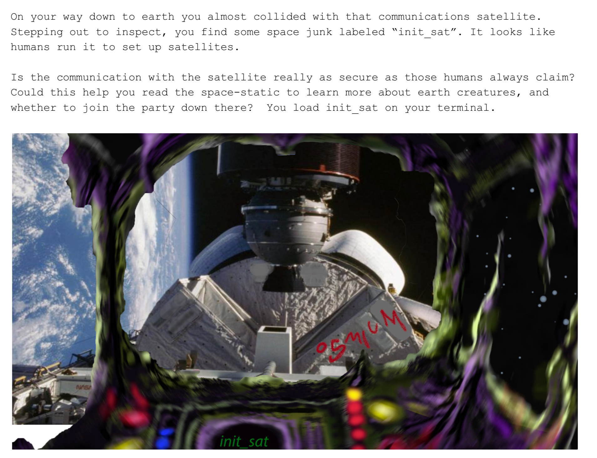
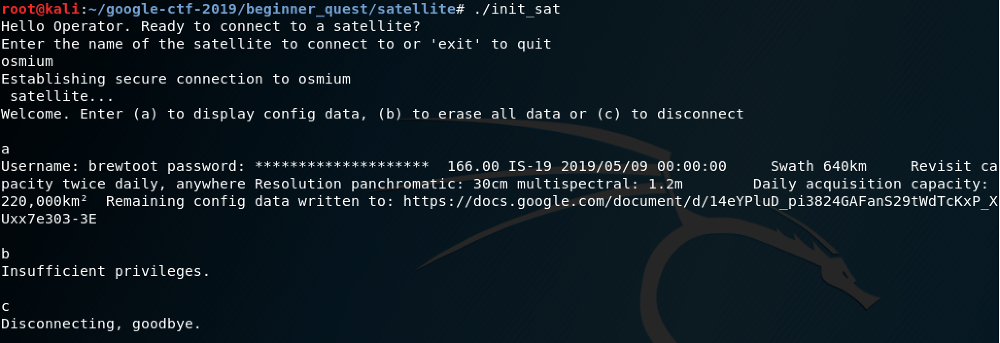

# Satellite (networking) 

## Prompt

Having successfully figured out this "coordinate" problem. The ship lurches forward violently into space. This is one of the moments when you realize that some kind of thought or plan would have been good, but typically for you and how you found yourself in this situation, you didn't think too much before acting. Only the stars themselves know where you'll end up.

After what seems like an eternity, or at least one full season of "Xenon's Next Top Galactic Overlord" you arrive in a system of 9 planetary bodies, though one of them is exceptionally small. You nostalgically remember playing explodatoid with your friends and hunting down planets like this. But this small planet registers a hive of noise and activity on your ships automated scanners. There's things there! Billions upon trillions of things, moving around, flying, swimming, sliding, falling.

Of particular interest may be the insect-like creatures flying around this planet, uniformly. One has the words "Osmium Satellites" written on it. Maybe this is a starting point to get to know what's ahead of you.

Placing your ship in range of the Osmiums, you begin to receive signals. Hoping that you are not detected, because it's too late now, you figure that it may be worth finding out what these signals mean and what information might be "borrowed" from them. Can you hear me Captain Tim? Floating in your tin can there? Your tin can has a wire to ground control?

Find something to do that isn't staring at the Blue Planet.

## Files

* `files.zip`: Provided zip file that contains `init_sat` and `README.pdf`.
* `init_sat`: A satellite console program.
* `README.pdf`: A PDF file containing some text and an image of a satellite.
* `creds`: A directory that holds credentials found using the satellite client program.
* `flag.txt`: The solution to this challenge.

## Solution

**NOTE: Some values in this challenge have been modified since I first saw it. The same commands will work, but you may have to substitute the new values in those commands to get them to work correctly**

The first thing I always try is running the program:

```
$ ./init_sat
Hello Operator. Ready to connect to a satellite?
Enter the name of the satellite to connect to or 'exit' to quit
```

I tried a few names with not much luck. Next I opened up `README.pdf` to see if it had any relevant information:



There's the satellite name! Putting that into the `init_sat` program connects us to the Osmium satellite.



The `display config data` option seems the most interesting because it has a link to more config data. Let's try following this trail. Heading to <https://docs.google.com/document/d/14eYPluD_pi3824GAFanS29tWdTcKxP_XUxx7e303-3E> gives us the following string:

```
TG9naW5zIGZvciBob21lIGFuZCB3b3JrIGNvbXB1dGVyOgpVc2VybmFtZTogd2Vib3J0dG8KUGFzc3dvcmQ6IHRvdGFsbHktbm90LWEtZmxhZy1rZWVwLXNuaWZmaW5nCg==
```

This looks like a base64 strings, so let's try to decode it.

```
echo TG9naW5zIGZvciBob21lIGFuZCB3b3JrIGNvbXB1dGVyOgpVc2VybmFtZTogd2Vib3J0dG8KUGFzc3dvcmQ6IHRvdGFsbHktbm90LWEtZmxhZy1rZWVwLXNuaWZmaW5nCg== | base64 -D
Logins for home and work computer:
Username: webortto
Password: totally-not-a-flag-keep-sniffing
```

That worked, but did not get us the flag. Hmmm... This is a network challenge, so maybe the password for this `webroot` user is a hint that we need to sniff traffic and intercept the `brewtoot` user's credentials before they are hidden in the terminal output. New hints have been added to this challenge since I solved it that suggest Wireshark, but I'm going to use `tcpdump`.

Once a connection has been established with the Osmium satellite, the remote IP address can be determined using `netstat`:

```
netstat -tn
Active Internet connections (w/o servers)
Proto Recv-Q Send-Q Local Address           Foreign Address         State      
tcp        0      0 10.0.2.15:59768         34.76.101.29:1337       ESTABLISHED
```

We can set up `tcpdump` to view the data coming in packets from that IP and hopefully get another lead. The `-i` option selects a network interface. Run `ip a` to find out what the name of your interface is. `-A` prints each packet in Ascii. `src` says to only dump packets coming from that IP address. 

```
tcpdump -i eth0 -A src 34.76.101.29
```

Now when we select the `display config data` option we should see a packet come in with that information:

```
Username: brewtoot password: CTF{4efcc72090af28fd33a2118985541f92e793477f}
```

There's the flag!
