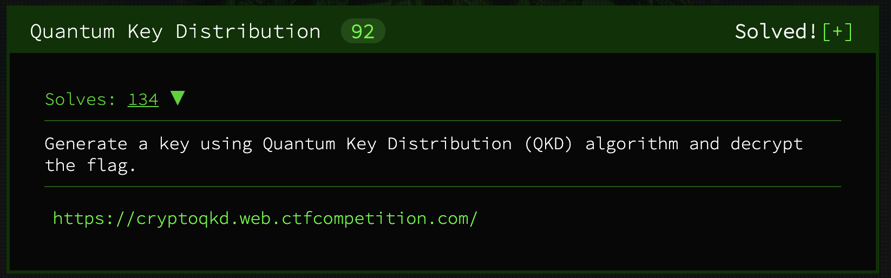

# Quantum Key Distribution - Satellite Key Exchange *(Crypto)*



## Challenge

We are simulating a Quantum satellite that can exchange keys using qubits implementing BB84. You must POST the qubits and basis of measurement to `/qkd/qubits` and decode our satellite response, you can then derive the shared key and decrypt the flag. Send 512 qubits and basis to generate enough key bits.

### How to send qubits

POST your qubits in JSON format the following way:

* **basis**: List of '+' and 'x' which represents the axis of measurement. Each basis measures one qubit:
    - +: Normal axis of measurement.
    - x: π/4 rotated axis of measurement.

* **qubits**: List of qubits represented by a dict containing the following keys:
    - real: The real part of the complex number (int or float).
    - imag: The imaginary part of the complex number (int or float).

The satellite respondes:

* **basis**: List of '+' and 'x' used by the satellite.

* **announcement**: Shared key (in hex), the encryption key is encoded within this key.

### Example decryption with hex key 404c368bf890dd10abc3f4209437fcbb:

```
echo "404c368bf890dd10abc3f4209437fcbb" > /tmp/plain.key; xxd -r -p /tmp/plain.key > /tmp/enc.key
```

```
echo "U2FsdGVkX182ynnLNxv9RdNdB44BtwkjHJpTcsWU+NFj2RfQIOpHKYk1RX5i+jKO" | openssl enc -d -aes-256-cbc -pbkdf2 -md sha1 -base64 --pass file:/tmp/enc.key
```

### Flag (base64)

```
U2FsdGVkX19OI2T2J9zJbjMrmI0YSTS+zJ7fnxu1YcGftgkeyVMMwa+NNMG6fGgjROM/hUvvUxUGhctU8fqH4titwti7HbwNMxFxfIR+lR4=
```

## Files

## Steps

1. Read code and format at `https://cryptoqkd.web.ctfcompetition.com/`
2. Write program to send random qubits and bases to satellite
3. Use response to compare bases and derive shared key
4. Figure out how encryption key is encoded with our shared key
5. It's xor

