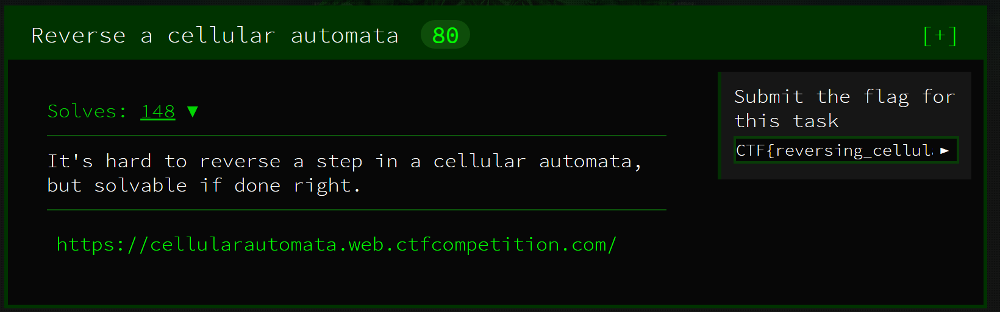
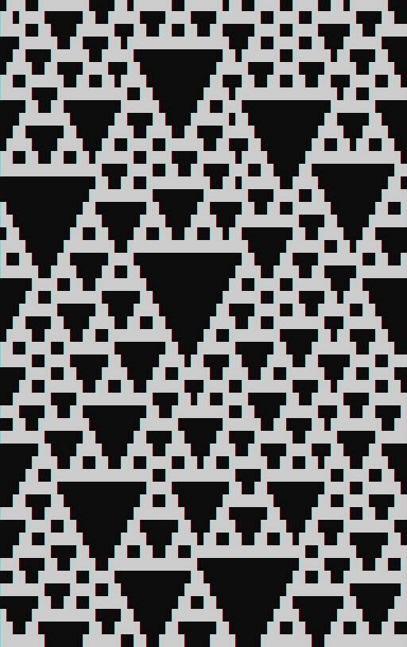

# [Reverse Cellular Automata](https://cellularautomata.web.ctfcompetition.com/)



## Challenge

We have built a cellular automata with 64 bit steps and obeys Wolfram rule 126, it's boundary condition wraps around so that the last bit is a neighbor of the first bit. Below you can find a special step we chose from the automata.

The flag is encrypted with AES256-CBC, the encryption key is the previous step that generates the given step. Your task is to reverse the given step and find the encryption key.

### Example decryption with 32 bit steps:

```
echo "404c368b" > /tmp/plain.key; xxd -r -p /tmp/plain.key > /tmp/enc.key
```

```
echo "U2FsdGVkX18+Wl0awCH/gWgLGZC4NiCkrlpesuuX8E70tX8t/TAarSEHTnpY/C1D" | openssl enc -d -aes-256-cbc -pbkdf2 -md sha1 -base64 --pass file:/tmp/enc.key
```

### Flag (base64)

```
U2FsdGVkX1/andRK+WVfKqJILMVdx/69xjAzW4KUqsjr98GqzFR793lfNHrw1Blc8UZHWOBrRhtLx3SM38R1MpRegLTHgHzf0EAa3oUeWcQ=
```

### Obtained step (hex)

```
66de3c1bf87fdfcf
```

## Files

* `cellular_automata.py`: Cellular automata program that starts with the provided step and follows the rules in the challenge prompt.
* `cell_test.py`: Takes one step and runs it through one round of Wolfram rule 126 to see if it matches the desired step.
* `mask_gen.py`: Generates a mask that shows what values in a previous step must be equal in order to result in the desired step.
* `key.txt`: File to show how the mask is interpreted in order to reduce the keyspace.
* `cryptanalysis.py`: Brute force steps to get every possible reverse step.
* `reverse.txt`: List of all possible reverse steps.
* `decrypt.py`: Decrypt the flag using every possible reverse step key.
* `flag.txt`: Solution to this challenge.

## Solution

I started this challenge off by refreshing my cellular automata memory. Rule 126 was new to me, so I did some research to understand as much I could about this type of cellular automata as possible before writing any code. 


I then wrote a program that would use rule 126 starting at the provided step to see if there was a loop that would allow me to happen upon a reverse step. Unfortunately it was not that easy, but the output of the program looks cool.



After about ~100 iterations, the automata gets into an infinite loop of mostly zeros and I realize that I'm probably going to need to go down the brute force route. 64 bit steps means 2<sup>64</sup> keys, not tractable in a weekend. I looked into some other reversing techniques to no avail and finally settled on attempting to reduce the keyspace myself.

The rule 126 chart above shows that the only two ways to get a '0' value are all '1's or all '0's. Depending on the step being reversed, this could help reduce the key space tremendously. Here is what the given step looks like in binary:

```
0110011011011110001111000001101111111000011111111101111111001111
```

The left, center, and right values of the previous step for every '0' bit must be the same. There are also many adjacent '0's in the desired step given, meaning all of those previous bits can be treated as one bit. For example, a normal 4 bit step of `0000` has a key space of 2<sup>4</sup>, but under rule 126 there are only two possible reverse steps: `1111` or `0000`.

Using this key space reduction technique, every substring that matches `10...1`  can be reduced to a single variable bit. This reduces the key space for the reversing the given step to 2<sup>33</sup>! That's great, but it could be even better.

When there are two of these substrings (`10...1`) right next to each other, they can be further reduced to a single bit! `1011001` can be broken down into two of these substrings: `101` and `1001`. If `101` reversed is `111` and `1001` is `1111`, it would be impossible for the middle '1's to exist. So if `101` reversed is `111`, `1001` must have a reverse of `0000`. This only happens 4 times in the provided step, but that's enough to reduce the key space down to 2<sup>29</sup>.

The reverse step can now be brute forced relatively quickly to get a list of all possible reverse steps and each of those reverse steps can be tried as a key to decrypt the flag. Only two of these reverse steps actually work:

```

```

These keys can be used to follow the provided decryption instructions and get the flag!

## Resources

[**Rule 126** WolframMathWorld](http://mathworld.wolfram.com/Rule126.html)
