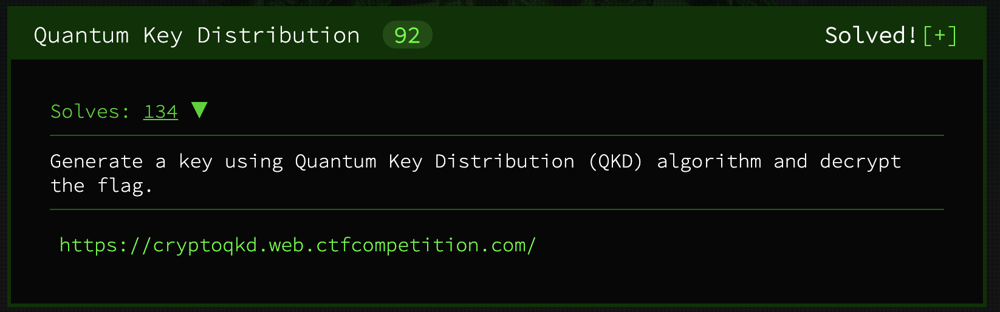
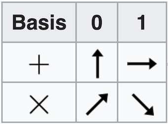

# [Quantum Key Distribution - Satellite Key Exchange](https://cryptoqkd.web.ctfcompetition.com/) 



## Challenge

We are simulating a Quantum satellite that can exchange keys using qubits implementing BB84. You must POST the qubits and basis of measurement to `/qkd/qubits` and decode our satellite response, you can then derive the shared key and decrypt the flag. Send 512 qubits and basis to generate enough key bits.

### How to send qubits

POST your qubits in JSON format the following way:

* **basis**: List of '+' and 'x' which represents the axis of measurement. Each basis measures one qubit:
    - +: Normal axis of measurement.
    - x: π/4 rotated axis of measurement.

* **qubits**: List of qubits represented by a dict containing the following keys:
    - real: The real part of the complex number (int or float).
    - imag: The imaginary part of the complex number (int or float).

The satellite responds:

* **basis**: List of '+' and 'x' used by the satellite.

* **announcement**: Shared key (in hex), the encryption key is encoded within this key.

### Example decryption with hex key 404c368bf890dd10abc3f4209437fcbb:

```
echo "404c368bf890dd10abc3f4209437fcbb" > /tmp/plain.key; xxd -r -p /tmp/plain.key > /tmp/enc.key
```

```
echo "U2FsdGVkX182ynnLNxv9RdNdB44BtwkjHJpTcsWU+NFj2RfQIOpHKYk1RX5i+jKO" | openssl enc -d -aes-256-cbc -pbkdf2 -md sha1 -base64 --pass file:/tmp/enc.key
```

### Flag (base64)

```
U2FsdGVkX19OI2T2J9zJbjMrmI0YSTS+zJ7fnxu1YcGftgkeyVMMwa+NNMG6fGgjROM/hUvvUxUGhctU8fqH4titwti7HbwNMxFxfIR+lR4=
```

## Files

* `quantum_client.py`: A program that negotiates a shared key with the satellite and decrypts the flag.
* `satellite_source.py`: Provided portion of the satellite source code.
* `flag.txt`: The solution to this challenge.
 
## Solution

I had never heard of the BB84 protocol, so I started this challenge off by researching that particular Quantum Key Distribution techique. [This video](https://www.youtube.com/watch?v=UVzRbU6y7Ks) by Creature Mann helped me understand how the protocol works at a theoretical level. On the practical end of the spectrum, Wikipedia helped me understand how to represent qubits and photon polarization states in Python.

In order for the satellite to send the encryption key securely, a shared key needs to be negotiated with the satellite that will encrypt communications back and forth. This simulation of BB84 requires 512 simulated qubits along with their corresponding bases. It's important to note that this simulation of key distribution is in no way secure. Anyone that intercepted the client request and server response would be able to derive the key. 

Generating random strings of '+' and 'x' is simple in Python, but translating those characters into complex number representations of qubits is not so intuitive. Luckily, the provided source code and the diagram below from Wikipedia gave me enough information to figure it out. A randomly chosen basis with a randomly generated bit is encoded using one of four states: 0, 45, 90, and 135 degrees on the unit circle in rectangular form. 



Now that the qubits could be generated and then posted to the satellite, the next problem was understanding the response. The first component is the list of bases used to derive the key and the second part is the encrypted encryption key. The satellite encrypts the flag encryption key with the newly negotiated key in order to secure the response. To derive the shared key, the satellite source code can be used to provide some insight into how the key is generated:

```
for bit, tx_base, rx_base in zip(measure, tx_bases, rx_bases):
    if tx_base == rx_base:
    ret += bit
```

The satellite takes each basis received and compares it with the basis it used to measure the qubit. If the bases are the same, the qubit becomes a part of the shared key.

```
binary_key = binary_key[:len(current_app.config['ENCRYPTION_KEY'])*4]
```

The key is also truncated to make sure it matches the length of the encryption key. Using the decryption example provided, this length is likely 128 bits. Now the shared key can be derived, used to decrypt the response, and then decrypt the flag! But there is one important detail that the challenge information did not provide: the encryption scheme used to encrypt the flag's encryption key with the shared key.

The first idea that came to mind was the same encryption scheme used in the decrpytion example: AES-256 in CBC mode. I was having issues with OpenSSL version compatibility so I was worried that I might be on the right track but not know it because of OpenSSl errors. After trying many different things, I gave up on AES and re-read the challenge document very closely:

> Shared key (in hex), the encryption key is encoded within this key.

Even though this is a shared key, the response documentation uses the word 'encoded' rather than 'encrypted'. Another clue is that the shared key needs to be the same length as the encryption key. This nudged me in the right direction and I finally concluded that the encoding/encryption scheme was the XOR operation. I tested this hypothesis by getting a shared key, XORing it with the satellite announcement, and then recording the result. I ran the same test again, which confirmed that XOR was the correct operation because the results matched each other in both tests even though the shared keys were different.

After deducing the encoding scheme, I followed the provided decryption examples to finally retrieve the flag!

```
CTF{you_performed_a_quantum_key_exchange_with_a_satellite} 
```

## Resources

* [**The BB84 Protocol** by Creature Mann](https://www.youtube.com/watch?v=UVzRbU6y7Ks)
* [**BB84** Wikipedia Page](https://en.wikipedia.org/wiki/BB84)
* [**Quantum key distribution** Wikipedia Page](https://en.wikipedia.org/wiki/Quantum_key_distribution)
